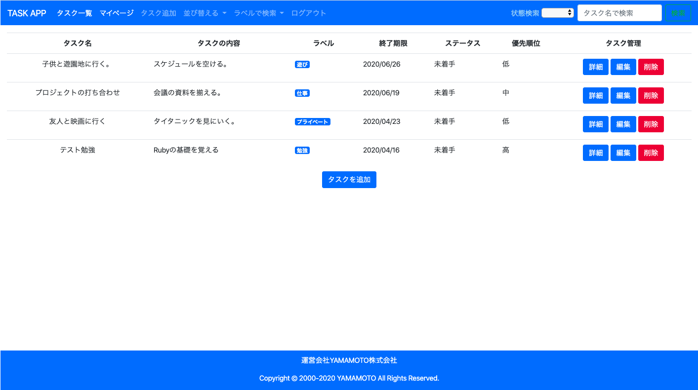

# README
# DIC課題(5/6)：株式会社万葉様新入社員教育課題
## Heroku：https://intense-tor-16889.herokuapp.com/

## ホーム画面


## バージョン
- Ruby 2.6.3
- Rails 5.2.3

## 機能一覧

- [ ] タスク投稿機能
  - [ ] 投稿CRUD機能（一覧、作成、詳細、更新、削除）
  - [ ] タスク検索機能（ラベル、状態、タスク名）
  - [ ] タスク並べ替え機能（終了期限、優先順位）
- [ ] ユーザー機能
  - [ ] 投稿CRUD機能（一覧、作成、詳細、更新、削除）
- [ ] ユーザ管理機能
    - [ ] ユーザのCURD機能（作成、詳細、更新、削除）
- [ ] ログイン機能
- [ ] ゲストログイン機能

## ER図


## How to Start

```
1. $ git clone  (クローン生成)
2. $ cd manyou_task https://github.com/KakeruYamamoto/manyou_task.git (作成後、対象のディレクトリから抜けてしまうので、そのディレクトリ移動)
3. $ bundle install
4. $ yarn install
5. $ rails db:create (データベースの生成)
6. $ rails db:migrate （マイグレーションファイルの実行）
7.  #config/initializers/locale.rb内の"I18n"の二行をコメントアウト（8.のコマンド終了後、戻す）
8. $ rails db:seed (シードデータの生成)
9. $ rails s  
```
